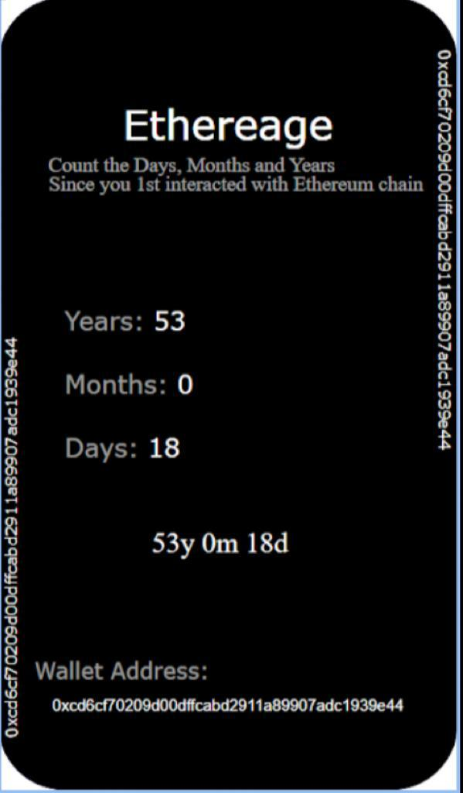

# Proof of Age NFT

## Inspiration

A lot of people are building NFTs nowadays. But most of those NFTs are just static images of something that people find interesting with no deeper use case. There has been scarcity of NFTs that actually promote interactive and imaginative uses of a permissionless state machine aka EVM. We wanted to build an NFT that had a core blockchain background.

## What is it? 

This is a Dynamic NFT that is the proof of your age on Ethereum. It displays the time that passed since you made your first Ethereum transaction and hence is what we like to call, “Etherage”.

## How we built it

1. We take the address of the user and fetch the timestamp of his first ehtereum transaction from etherscan API and store it in our smart contract. 
The image code is written in SVG so that it can be put on chain. 
2. We have implemented ERC721UriStorage token. 

## Contracts deployed and verified on Goerli testnet

deployer: 0xf3cc1a256989557484975e24a29c638fe756f6b1

Renderer.sol: 0x39A96415877d441d25aFB059AEf4218Db5C2256A

YourCollectible.sol: 0xcF7F46998A5808C0bB3fC323F39ddBEd0b53C902

## Use cases targeted

1. This nft can be used as a proof of the time a person has been present on ethereum

2. This can be used as a birth certificate in future.

